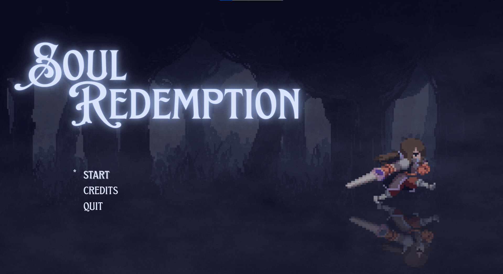

# SoulRedemptionPygames - Desperte e Descubra

[](https://github.com/[seu-usuario]/[seu-repositorio]/projects/)
[](https://www.python.org/)
[](https://www.pygame.org/)



## 📜 Descrição do Jogo

Em **Soul Redemption**, você embarca em uma jornada intensa através das emoções humanas mais profundas, enfrentando seus próprios medos, raiva e culpa.

- **O Medo:** Você desperta em uma floresta escura e desconhecida, desorientado e sem memórias. Criaturas hostis surgem das sombras enquanto você luta para entender onde está e como sobreviver.

- **A Raiva:** Conforme fragmentos do seu passado vêm à tona, a raiva toma conta. O cenário se torna mais agressivo, refletindo batalhas intensas e uma fúria crescente, onde cada inimigo vencido representa uma pequena vitória contra a dor interior.

- **A Culpa:** No capítulo final da jornada, você encara seus próprios arrependimentos em um ambiente sombrio e carregado de tensão emocional. O desafio não é apenas físico, mas também psicológico: enfrentar a si mesmo.

Cada fase de **Soul Redemption** representa uma luta emocional única, tornando cada partida uma experiência profunda e inesquecível. Explore, lute e descubra a verdade para conquistar a sua redenção.


## ✨ Principais Características

* **mundos dinamicos:** Explore mapas únicos e tematicos, garantindo uma imersão no tema.
* **Descoberta de Memórias:** Colete fragmentos de memória espalhados pelo mundo para entender sua história e o que aconteceu.
* **Sistema de Habilidades Dinâmico:** Desbloqueie novas habilidades ao longo da sua jornada, alterando seu estilo de jogo e oferecendo novas estratégias.
* **Combate Desafiador:** Enfrente uma variedade de inimigos com comportamentos distintos, exigindo táticas inteligentes e reflexos rápidos.
* **Progressão Persistente (Limitada):** Embora cada partida seja única, alguns elementos podem persistir entre as tentativas, como o conhecimento de certas mecânicas ou desbloqueio de habilidades base.
* **Visual Pixel Art:** Desfrute de um estilo visual nostálgico e charmoso, criado com Pixilart.
* **Interface Intuitiva:** Desenvolvida com foco na experiência do jogador, utilizando princípios de design definidos no Figma.

## 🛠️ Ferramentas e Bibliotecas Utilizadas

* **Python:** Linguagem de programação principal.
* **Pygame:** Biblioteca para criação de jogos 2D em Python.
* **Tiled:** Editor de mapas 2D utilizado para criação e organização dos cenários do jogo.
* **sys:** Biblioteca padrão do Python para funcionalidades do sistema.
* **Pixilart:** Ferramenta online para criação de gráficos em pixel art.
* **Figma:** Ferramenta de design de interface do usuário (UI) e prototipagem.
* **Pinterest:** Plataforma para inspiração visual e coleta de referências.
* **ImgTools:** Ferramenta para manipulação e conversão de imagens.
* **Canva:** Ferramenta de design gráfico para criar materiais de divulgação e outros recursos visuais.

## 🧪 Metodologia
As principais etapas do processo foram:

* **Planejamento Inicial:** Definição da ideia central, escopo inicial do projeto e escolha das ferramentas de desenvolvimento e design.
* **Prototipação:** Criação de versões básicas das mecânicas principais, como movimentação, combate e interação com o ambiente.
* **Design de Mapas:** Utilização do Tiled para construir cenários variados e dinâmicos, otimizados para a jogabilidade.
* **Desenvolvimento Visual:** Criação dos personagens, inimigos, cenários e interfaces em pixel art com o auxílio do Pixilart e Figma.
* **Organização e Acompanhamento:** Utilização da metodologia Kanban para registrar, acompanhar e organizar todas as tarefas do projeto.
* **Testes Iterativos:** Testes constantes de jogabilidade, correção de bugs e balanceamento de dificuldade, visando melhorar a experiência do usuário.
* **Refinamento Final:** Integração de cutscenes, efeitos sonoros, trilhas musicais e ajustes finais de polimento no jogo.

Essa abordagem permitiu flexibilidade nas entregas, foco na qualidade da experiência do jogador e uma gestão de tempo mais eficiente.

## 🚀 Começando

### Pré-requisitos

* **Python 3.x:** Certifique-se de ter o Python instalado em sua máquina. Você pode baixá-lo em [https://www.python.org/downloads/](https://www.python.org/downloads/).

### Instalação

1.  Clone este repositório para a sua máquina local:

    ```bash
    git clone [[https://github.com/](https://github.com/)[seu-usuario]/[seu-repositorio].git](https://github.com/Dronato/SoulRedemptionPygames.git)
    ```

2.  Navegue até o diretório do projeto:

    ```bash
    cd SoulRedemptionPygames
    ```
3.  baixe as bibliotecas do requirements.txt:

    ```bash
    pip install -r requirements.txt
    ```
### Executando o Jogo

Para iniciar o jogo, execute o seguinte comando no seu terminal:

```bash
py main.py
```
## 🤝 Autores

Agradecemos às seguintes pessoas que contribuíram para este projeto:

<table>
  <tr>
    <td align="center">
        <sub>
          <b>Rafaela Botelho</b>
          <br>
          <a href="https://github.com/bruxa61">(github.com/bruxa61)</a>
        </sub>
    </td>
    <td align="center">
        <sub>
          <b>Carlos Eduardo</b>
          <br>
          <a href="https://github.com/cDorth">(github.com/cDorth)</a>
        </sub>
    </td>
    <td align="center">
        <sub>
          <b>Pedro Odake</b>
          <br>
         <a href="https://github.com/pe-odake">(github.com/pe-odake)</a>
        </sub>
    </td>
    <td align="center">
        <sub>
          <b>Guilherme Pereira</b>
           <br>
          <a href="https://github.com/gprsilva">(github.com/gprsilva)</a>
        </sub>
    </td>
    <td align="center">
        <sub>
          <b>Bruna Barboza</b>
           <br>
          <a href="https://github.com/brubsb">(github.com/brubsb)</a>
        </sub>
    </td>
    <td align="center">
        <sub>
          <b>Davi Torralvo</b>
           <br>
         <a href="https://github.com/DaviTorralvo">(github.com/DaviTorralvo)</a>
        </sub>
    </td>
    <td align="center">
        <sub>
          <b>Raí Carvalho</b>
           <br>
          <a href="https://github.com/Rai123100">(github.com/Rai123100)</a>
        </sub>
    </td>
        <td align="center">
        <sub>
          <b>Arthur Américo</b>
          <br>
         <a href="https://github.com/intentdoor">(github.com/intentdoor)</a>
        </sub>
    </td>
        <td align="center">
        <sub>
          <b>Matheus Vicente</b>
           <br>
          <a href="https://github.com/vicenteruedamatheus">(github.com/vicenteruedamatheus)</a>
        </sub>
    </td>
  </tr>
</table>
